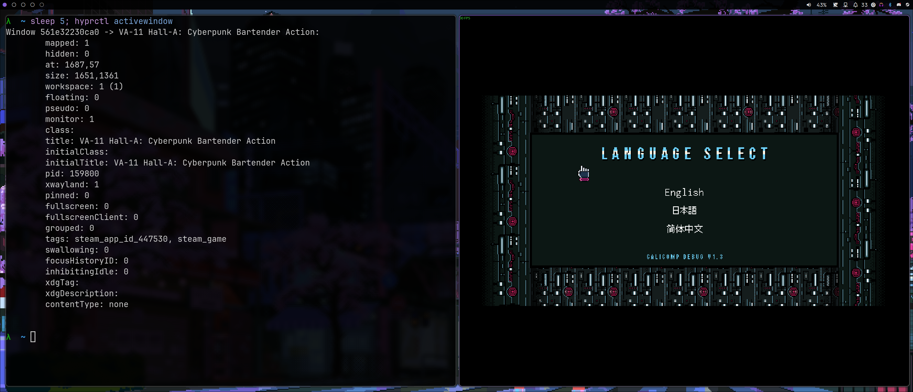

# hypr_steam_watcher
<!-- [](https://aur.archlinux.org/packages/hypr_steam_watcher-git) -->
<!-- [](https://github.com/LennardKittner/hypr_steam_watcher/releases) -->
<!-- [](https://github.com/LennardKittner/hypr_steam_watcher/releases) -->
Automatically tags newly launched Steam games in Hyprland so you can target or exclude them in window rules without manual configuration.

<p align="center">
  
  <br>
  <em>VA-11 Hall-A tagged with steam_game and steam_app_id_447530</em>
</p>

`hypr_steam_watcher` listens for newly created windows in Hyprland and automatically tags Steam game windows with `steam_game` and `steam_app_id_<game-id>`.
This allows you to exclude Steam games from certain window rules or define specific window rules that only apply to Steam games.
```
windowrule = match:class .*, match:tag negative:steam_game, opacity 0.9 # everything except steam games is transparent
windowrule = match:tag steam_game,opacity no_blur                       # disable blur for steam games
windowrule = match:class .*, match:tag steam_app_id_12345, workspace 3  # launch window for the steam game with app ID 12345 on workspace 3
```

## Compatibility
The app works with both native Linux and Proton games.

## Requirements
- Hyprland (Wayland compositor)
- Steam
- Rust (only if building from source)

## Installation

### Release
You can download a prebuilt version from the [releases](https://github.com/LennardKittner/hypr_steam_watcher/releases).
Then add `exec-once = hypr_steam_watcher` to your `hyprland.conf` to start it automatically.

### Build from Source
You can build the project from source using cargo:
```bash
git clone https://github.com/LennardKittner/hypr_steam_watcher.git
cd hypr_steam_watcher
cargo build --release
sudo cp target/release/hypr_steam_watcher /usr/bin/
```
Then add `exec-once = hypr_steam_watcher` to your `hyprland.conf` to start it automatically.

## Usage
```
hypr_steam_watcher --help
Automatically tag newly launched Steam games in Hyprland.

Usage: hypr_steam_watcher [callback] [callback-arguments]...

Arguments:
  [callback]               A callback that will be called when a new window of a steam game appears.
  [callback-arguments]...  Arguments for the callback. The PID and Steam app ID will be appended to the arguments.

Options:
  -h, --help     Print help
  -V, --version  Print version
```
Running `hypr_steam_watcher` without any arguments will tag any Steam games launched while this app is running.

It is also possible to provide a callback, e.g., `hypr_steam_watcher echo game:` or `hypr_steam_watcher ./activate_game_mod.sh`.
hypr_steam_watcher will call the callback in a non-blocking way whenever a new Steam game starts and appends the PID and Steam app ID of the newly executed game to the parameters for the callback.
Thus, `hypr_steam_watcher echo game:` will print `game: <pid> <steam_app_id>` once to the console every time a new Steam game is launched.
You can also run more complex expressions like `hypr_steam_watcher bash -c 'sleep 2 && echo game: "$0 $1"'` this will also print `game: <pid> <steam_app_id>` after a two-second delay.

### Callback Arguments

The callback receives:

`[callback-arguments...] <pid> <steam_app_id>`

## Use Cases
- Disable blur or transparency for games
- Automatically move games to a dedicated workspace
- Enable performance scripts automatically
- Apply per-game rules using Steam App IDs

## How it works
- Uses the hyprland crate to detect new windows
- Gets the PID
- Checks whether the environment of the process contains `SteamAppId`
- Uses the hyprland crate to tag the window
- Executes the callback (if provided)

## Troubleshooting 
- Ensure hypr_steam_watcher is running
- Start it before launching the game

If a game is not tagged correctly, please open an issue and include:
- Game name
- Native or Proton
- Output of `hyprctl activewindow`

## License
MIT see LICENSE file
